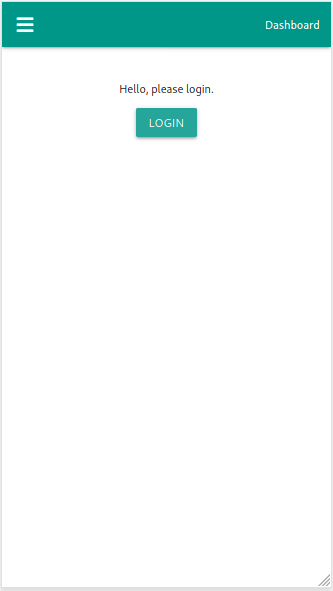
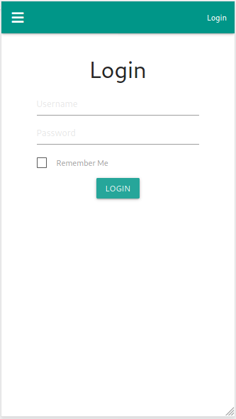
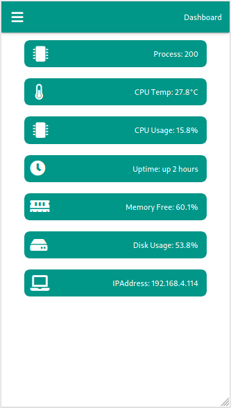
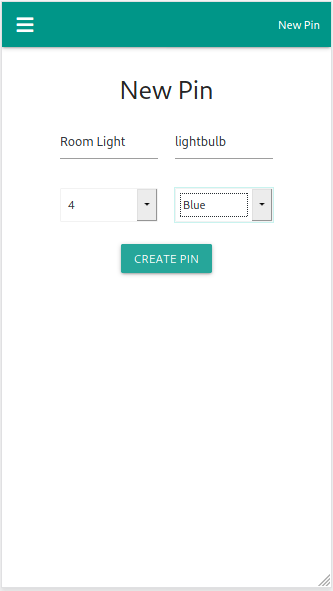
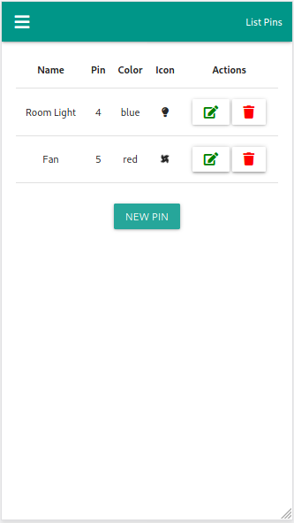
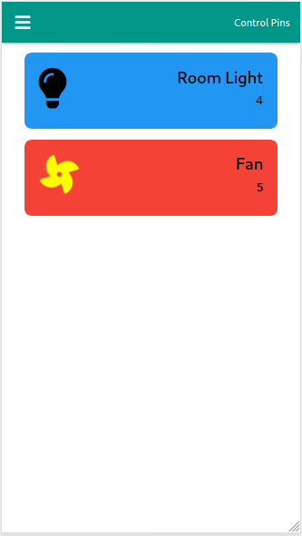
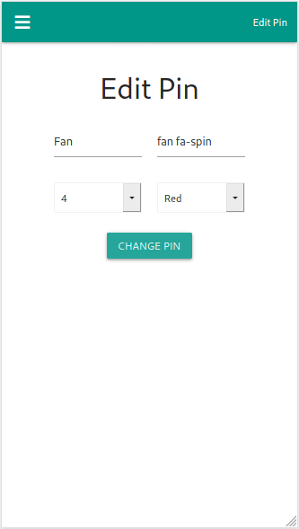
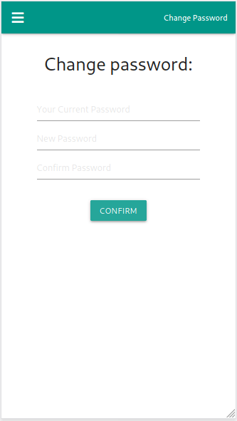

### LisaPi - Flask Application

Control your Raspberry Pi Pins with Flask application.

*Tested in models B+ and 3B+*


Features:
- Login
- Some system info in dashboard (auto update using webockets).
- Register pins to control.
- Control state of pins between on/off.
- PWA Ready.


Flask modules:
- Flask-Login
- Flask-WTF
- Flask-Migrate
- Flask-SQLAlchemy
- Flask-SocketIO


System requirements:
```sudo apt install build-essential libssl-dev libffi-dev python3-dev```


Development (using poetry):
  1. Clone project,
  2. Enter in project folder,
  3. Install dependencies with poetry: ```poetry install```,
  4. Run migrations: ```flask db init && flask db migrate && flask db upgrade```,
  5. Create admin user: ```flask seed```,
  6. Run project in development mode: ```python wsgi.py```.


Production:
  1. [Deploy with Supervisor](https://github.com/bergpb/lisapi/wiki/Deploy-with-Supervisor)
  2. [Deploy with Nginx](https://github.com/bergpb/lisapi/wiki/Deploy-with-Nginx)


To do:
- [x] User login.
- [x] Save pins in database.
- [x] Check if pin is disponible before register.
- [x] Verify if pins exist in Raspberry Pi GPIO.
- [x] Return system status in dashboard (auto update using websockets).
- [X] PWA implementation.
- [ ] User permissions.
- [ ] Apply Unit Tests.
- [ ] RestFull Api.


Some project images:









